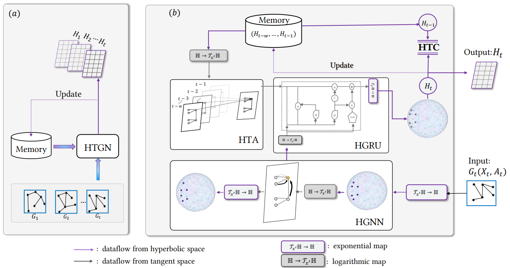

## 1. Overview

PyTorch Implementation for "[Discrete-time Temporal Network Embedding via Implicit Hierarchical Learning in Hyperbolic Space (KDD2021)](https://arxiv.org/abs/2107.03767)"

Authors: Menglin Yang; Min Zhou; Marcus Kalander; Zengfeng Huang; Irwin King

Paper: https://arxiv.org/pdf/2107.03767.pdf

Code: https://github.com/marlin-codes/HTGN



## 2. Setup

### 2.1 Environment
`pip install -r requirements.txt`

### 2.2 Datasets

The data is cached in `./data/input/cached`.
The raw datasets are in the folder `./data/input/raw`

Note: 
- The dataset with name ``dblp`` is the COLAB dataset in the paper. 
- [Link: to download more datasets](https://drive.google.com/file/d/1qv98H-mI2BtdNGexlTIm127xslHslxS1/view?usp=sharing)
## 3. Examples
3.0 Go to the script at first

```cd ./script```

3.1 To quickly run the code:

```python main.py --model=HTGN --dataset=enron10```

3.2 To run more examples about HTGN, static method, run the following 
```
bash example/run_htgn.sh
bash example/run_static.sh
bash example/run_grugcn.sh
```
3.3 To run DySAT, please refer to [DySAT](https://github.com/aravindsankar28/DySAT);

3.4 To run EvolveGCN, please refer to [EvolveGCN](https://github.com/IBM/EvolveGCN) or run the file
```bash example/run_evolvegcn.sh```;

3.5 To run VGRNN, please refer to [VGRNN](https://github.com/VGraphRNN/VGRNN);

Note: for a unified comparison, we use inner product as decoder for the baseline models.

## 4. Some of the code was forked from the following repositories
- [HGCN](https://github.com/HazyResearch/hgcn)
- [HyperRNN](https://github.com/ferrine/hyrnn)
- [EvolveGCN](https://github.com/IBM/EvolveGCN)
- [DySAT](https://github.com/aravindsankar28/DySAT)
- [VGRNN](https://github.com/VGraphRNN/VGRNN)
- [CTGCN](https://github.com/jhljx/CTGCN)
- [GloDyNE](https://github.com/houchengbin/GloDyNE)

## 5. Reference
[1] [Discrete-time Temporal Network Embedding via Implicit Hierarchical Learning in Hyperbolic Space](https://arxiv.org/abs/2107.03767).

[2] [Evolvegcn: Evolving graph convolutional networks for dynamic graphs](https://arxiv.org/abs/1902.10191).

[3] [Variational graph recurrent neural networks](https://arxiv.org/abs/1908.09710).

[4] [DySAT: Deep neural representation learning on dynamic graphs via self-attention networks](http://yhwu.me/publications/dysat_wsdm20.pdf)

## 6. Citation

If you find this code useful, please cite the following paper:

```
@inproceedings{yang2021discrete,
  title={Discrete-time Temporal Network Embedding via Implicit Hierarchical Learning in Hyperbolic Space},
  author={Yang, Menglin and Zhou, Min and Kalander, Marcus and Huang, Zengfeng and King, Irwin},
  booktitle={Proceedings of the 27th ACM SIGKDD Conference on Knowledge Discovery \& Data Mining},
  pages={1975--1985},
  year={2021}
}
```
